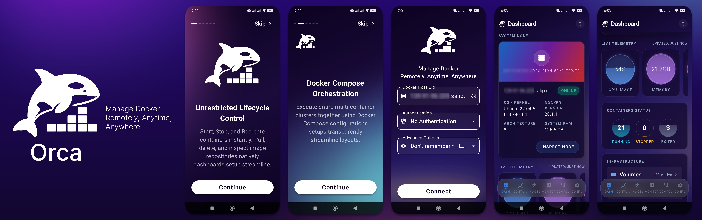
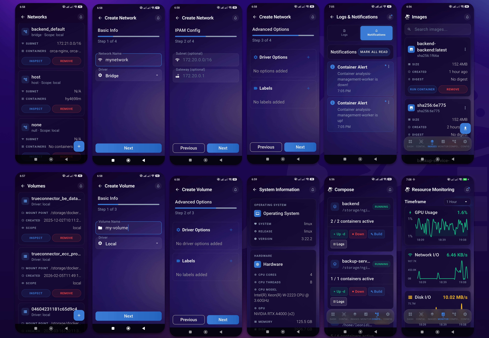
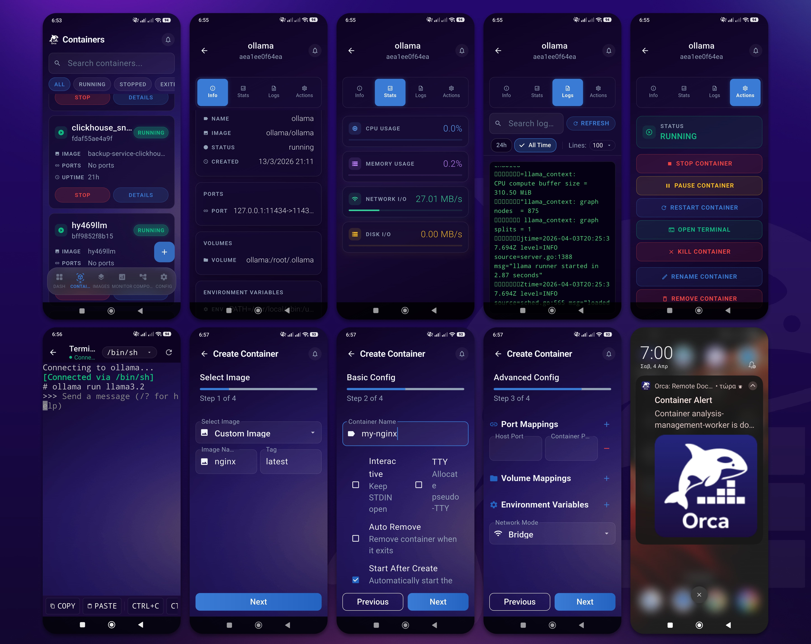

<p align="center">
  
</p>

<p align="center">
  
  
  
  
  
  <a href="https://github.com/nikosgiov/orca/releases">
    
  </a>
  <a href="https://hitsofcode.com/github/nikosgiov/orca/view?branch=main">
    
  </a>
  <a href="https://ghloc.vercel.app/nikosgiov/orca?branch=main">
    
  </a>
</p>

<p align="center">
  Orca is a comprehensive mobile solution for remote Docker management. By combining a lightweight Go proxy backend with a feature-rich Flutter application, it empowers developers and system administrators to securely deploy, monitor, and troubleshoot their containerized infrastructure intuitively from their mobile devices.
</p>

<p align="center">
  <a href="https://github.com/nikosgiov/orca/releases/latest">
    
  </a>
  &nbsp;
  <a href="https://apps.obtainium.imranr.dev/redirect?r=obtainium://add/https://github.com/nikosgiov/orca">
    
  </a>
</p>

---

## Table of Contents

- [Background & Motivation](#background--motivation)
- [Screenshots](#screenshots)
- [Architecture](#architecture)
- [Features](#features)
- [Getting Started](#getting-started)
  - [Prerequisites](#prerequisites)
  - [1. Firebase Setup](#1-firebase-setup)
  - [2. Backend Setup](#2-backend-setup)
  - [3. Mobile App Setup](#3-mobile-app-setup)
- [Project Structure](#project-structure)
- [Security Notes](#security-notes)
- [Tech Stack](#tech-stack)
- [License](#license)

---

## Background & Motivation

Managing Docker containers and monitoring system resources across remote servers can often be a repetitive and time-consuming process. Often, simple tasks like checking service status, spinning up containers, or monitoring system loads require a cumbersome workflow involving VPN connections, multi-factor authentication, and establishing SSH sessions.

**Orca** was built to streamline this process, providing a remote Docker management solution that allows system administrators and developers to manage and monitor their infrastructure directly from a mobile device without requiring a full desktop setup.

Key motivations for the project include:
- **Accessibility:** Providing secure, remote access to container management natively from a mobile interface.
- **Resource Monitoring:** Offering quick visibility into live system telemetry, including CPU, memory, and GPU load, to efficiently identify and resolve performance bottlenecks.
- **Real-Time Alerts:** Delivering push notifications for critical Docker events (such as container state changes or image deletions) ensuring immediate awareness of shared environment modifications.

---

## Screenshots

<p align="center">
  
</p>

<p align="center">
  
</p>

---

## Architecture

Since the project aims to minimize the footprint on the host system while maximizing mobile responsiveness, the architecture is split into a Go-based backend and a Flutter-based mobile application.

### Backend Overview
The backend is written in Go to act as a secure, lightweight reverse proxy alongside the Docker daemon.

- **API & Proxy Layer:** Built on a Chi router, this layer handles incoming HTTPs and JWT-authenticated requests, proxying them securely to the local `/var/run/docker.sock`.
- **Telemetry Collection:** A dedicated system service routine collects CPU, memory, disk I/O, network I/O, and NVIDIA GPU metrics natively via `gopsutil` and `nvidia-smi`.
- **Event Streaming & WebSockets:** Implements continuous listeners on the Docker event stream to dispatch Firebase Cloud Messaging alerts, and handles bi-directional xterm-compatible WebSocket streams for container shell execution.

### Mobile App (UI & State)
For the mobile interface, the app is built using Flutter and follows an MVVM-style state management approach leveraging the `Provider` package.

- **State Management:** The business logic is decoupled from the UI layers into dedicated Providers (e.g., `AppConfigProvider`, `CreateContainerProvider`, `LogsNotificationsProvider`). These providers act as ViewModels, reacting to user intents, orchestrating API calls to the Go backend, and notifying listeners to trigger UI rebuilds downstream.
- **Dependency Injection:** Core services and repositories are registered and retrieved using `get_it`, providing a clean, decoupled service locator pattern.
- **Routing:** Navigation is handled declaratively using `go_router`, offering robust deep-linking and route management.
- **Localization:** The app is configured for internationalization using Flutter's native `gen_l10n` approach.
- **UI Layer:** The views (Screens and continuous widgets) strictly observe the Provider states. Leveraging specialized widgets for features like live telemetry charts (`fl_chart`) and WebSocket terminal emulation (`xterm`), the UI reacts seamlessly.
- **Native Experience:** Includes a custom glassmorphism design system to deliver a visually premium, native-feeling app experience tailored for both Android and iOS.

### Persistence

- **Client-Side Storage:** Sensitive data like connection URLs, JWT tokens, and user preferences are persisted securely on the local device using `flutter_secure_storage` and `shared_preferences`. The mobile app acts as the single source of truth for the active host connection.
- **Server-Side Aggregation:** Instead of a complex local database, system telemetry data is maintained in-memory on the Go backend using multi-tier aggregation (1-second, 1-minute, and 1-hour rolls). This eliminates external database dependencies while ensuring historically grouped metrics are instantly available.

---

## Features

### Mobile App (Flutter)

| Feature | Description |
|---|---|
| **Dashboard** | At-a-glance system overview (hostname, OS, Docker version, architecture, RAM) with live telemetry gauges for CPU, memory, disk, and GPU usage |
| **System Information** | Dedicated screen for deep, detailed host telemetry and hardware information |
| **Container Deployment** | Fully featured wizard for configuring, deploying, and spinning up new containers from images |
| **Container Management** | List, start, stop, restart, remove, and inspect containers with full detail views including logs, environment variables, ports, mounts, and networking |
| **Event & Log Viewer** | Dedicated in-app screen to browse notification history and filter real-time Docker logs by container and log level |
| **Image Management** | Browse, pull, and delete Docker images with filtering and search |
| **Volume & Network Management** | Create, inspect, and remove volumes and networks |
| **Docker Compose** | Discover compose projects automatically, run `up`, `down`, `logs`, and other compose commands with real-time streamed output |
| **Interactive Terminal** | Full xterm-compatible exec shell sessions inside any running container via WebSocket to run commands natively |
| **Resource Monitoring** | Live charts for CPU, memory, disk I/O, network I/O, and GPU usage (NVIDIA) with selectable timeframes (30m, 1h, 6h, 24h) |
| **Push Notifications** | Firebase Cloud Messaging alerts for Docker events (container started/stopped/removed, images deleted) and resource threshold breaches |
| **Notification Settings** | Granular control to toggle Docker monitoring and resource monitoring independently, set custom CPU/memory/GPU thresholds |
| **Premium Native UI** | Custom glassmorphism design system integrated with dark and light themes for a modern visual aesthetic |
| **Auto-Refresh** | Configurable auto-refresh interval (5 to 300 seconds) for the dashboard and monitoring screens |
| **Onboarding & Security** | Animated onboarding flow, JWT-based secure authentication, and credentials stored safely on-device |

### Backend (Go)

| Feature | Description |
|---|---|
| **Docker Socket Proxy** | Reverse-proxies requests directly to the Docker Engine API via Unix socket or TCP, providing full Docker REST API access behind authentication |
| **JWT Authentication** | Username/password login with HS256-signed JWT tokens and configurable expiry |
| **Rate Limiting** | Per-IP rate limiting on all endpoints (100 req/min global, 5 req/min on login) to prevent abuse |
| **System Metrics Collection** | Collects CPU, memory, disk, disk I/O, network I/O, and NVIDIA GPU stats every second using `gopsutil` and `nvidia-smi` |
| **Multi-Tier Aggregation** | Stores 1-second granularity (last 60s), 1-minute averages (last 6h), and 1-hour averages (last 24h) for efficient long-range monitoring |
| **Docker Event Monitoring** | Continuously listens to the Docker event stream and broadcasts push notifications on container state changes |
| **Resource Threshold Alerts** | Monitors CPU and memory usage against configurable thresholds with a 5-minute cooldown to avoid alert storms |
| **Firebase Cloud Messaging** | Sends push notifications via FCM Admin SDK (requires a Firebase service account) |
| **Docker Compose Management** | Lists compose projects (auto-discovered from a configurable directory and running container labels), runs compose commands with streamed output via NDJSON |
| **WebSocket Exec** | Opens interactive `/bin/sh` sessions inside containers via WebSocket for the mobile terminal |
| **CORS Support** | Permissive CORS headers for cross-origin requests |
| **Dockerized Deployment** | Multi-stage Dockerfile producing a minimal Alpine-based image |

---

## Getting Started

### Prerequisites

- **Docker** and **Docker Compose** installed on the host machine
- A **Firebase** project (for push notifications)
- **Flutter SDK 3.8+** (only if you want to build the mobile app yourself)
- **Go 1.24+** (only if you want to build the backend outside of Docker)

---

### 1. Firebase Setup

Push notifications require a Firebase project. Follow these steps:

#### 1.1 Create a Firebase Project

1. Go to [Firebase Console](https://console.firebase.google.com/)
2. Click **"Add project"** and give it a name (e.g., `dockercontroller`)
3. Follow the wizard (you can disable Google Analytics if you want)

#### 1.2 Add an Android App to Firebase

1. In your Firebase project, click **"Add app"** then **Android**
2. Set the **Android package name** to: `com.ngiov.docker_controller`
   > If you changed the package name in `android/app/build.gradle`, use that instead.
3. (Optional) Set a nickname and SHA-1 signing certificate
4. Click **"Register app"**

#### 1.3 Download the Service Account Key

This is the JSON file the backend uses to send push notifications:

1. In Firebase Console, go to **Project Settings** then **Service Accounts**
2. Click **"Generate new private key"**
3. Save the downloaded JSON file. You will place it in the backend directory later

#### 1.4 Get the Firebase Client Configuration

You need these values for the `.env` file so the mobile app can initialize Firebase:

1. In Firebase Console, go to **Project Settings** then **General**
2. Scroll to **Your apps** and select your Android app
3. Note or copy the following values:
   - **API Key** (`apiKey`)
   - **App ID** (`appId`)
   - **Messaging Sender ID** (`messagingSenderId`)
   - **Project ID** (`projectId`)
   - **Storage Bucket** (`storageBucket`)

#### 1.5 Enable Cloud Messaging

1. In Firebase Console, go to **Project Settings** then **Cloud Messaging**
2. Make sure the **Cloud Messaging API (V1)** is enabled
   > If it says "disabled", click the three-dot menu and enable it in the Google Cloud Console link provided

---

### 2. Backend Setup

The backend ships with a Docker Compose stack that includes the Go server and an Nginx reverse proxy with optional TLS support.

For full backend setup instructions — including environment variables, Docker deployment, TLS/HTTPS configuration, and the Nginx proxy — see the **[Backend README](backend/README.md)**.

---

### 3. Mobile App Setup

#### Option A: Build from Source

```bash
cd orca/docker_controller
flutter pub get
flutter run
```

#### Option B: Build an APK

```bash
cd orca/docker_controller
flutter build apk --release
# APK will be at build/app/outputs/flutter-apk/app-release.apk
```

#### First Launch

1. On first launch you will see the **onboarding** screens (swipe through or skip)
2. On the **connection** screen, enter:
   - **Server URL**: `your-server-ip:9800`
   - **Username / Password**: The credentials you set in the `.env` file
3. Tap **Connect**. The app authenticates, receives a JWT token, and the Firebase client config is automatically provisioned from the server
4. Optionally go to **Config** > **Notification Settings** to register for push notifications and set your alert thresholds

---

## Project Structure

```
orca/
├── backend/                    # Go backend server
│   ├── cmd/server/main.go      # Entry point
│   ├── internal/
│   │   ├── api/
│   │   │   ├── router.go       # Chi router setup, CORS, rate limiting
│   │   │   ├── middleware/     # JWT auth, rate limiting middleware
│   │   │   └── routes/         # Handlers: auth, proxy, exec, compose, notifications, system
│   │   ├── config/             # ENV-based configuration
│   │   ├── models/             # Data structures for auth & system metrics
│   │   └── services/
│   │       ├── docker/         # Docker client, compose manager, event monitor
│   │       ├── notifications/  # Firebase Cloud Messaging (FCM) sender
│   │       └── system/         # Metrics collector (CPU/mem/disk/net/GPU), resource monitor
│   ├── Dockerfile              # Multi-stage build (Go 1.24 to Alpine)
│   ├── docker-compose.yml      # Backend + Nginx reverse proxy stack
│   ├── .env                    # Environment config (not committed)
│   └── firebase.json           # FCM service account key (not committed)
│
└── docker_controller/          # Flutter mobile application
    ├── lib/
    │   ├── core/               # Dependency injection (get_it), extensions, and core utilities
    │   ├── l10n/               # Localization delegates and ARB files
    │   ├── router/             # Declarative routing configuration (go_router)
    │   ├── main.dart           # App entry and service locator setup
    │   ├── app.dart            # Root widget, global provider setup, and router integration
    │   ├── screens/            # All UI screens
    │   ├── providers/          # State management (ViewModels)
    │   ├── services/           # API clients, notification service, Firebase handler
    │   ├── widgets/            # Reusable UI components
    │   ├── models/             # Data models
    │   ├── constants/          # Colors, themes, text styles, strings, dimensions
    │   └── utils/              # Formatters, validators, chart utilities
    ├── android/                # Android platform config
    ├── ios/                    # iOS platform config
    └── pubspec.yaml            # Flutter dependencies
```

---

## Security Notes

- **Credentials**: Change the default username/password and secret key before deploying
- **Network**: Expose the backend only through a reverse proxy (e.g., Nginx, Caddy) with TLS in production. The app supports TLS connections.
- **.env and firebase.json**: These files contain secrets. **Never commit them to version control**. Add them to `.gitignore`
- **Rate Limiting**: Built-in rate limiting helps prevent brute-force attacks (5 attempts/min on login, 100 req/min globally)
- **Docker Socket**: Mounting the Docker socket gives the backend full control over the Docker daemon, so only run this on trusted networks

---

## Tech Stack

| Layer | Technology |
|---|---|
| **Backend** | Go 1.24, Chi router, Docker Engine SDK, gorilla/websocket, golang-jwt, gopsutil, Firebase Admin SDK |
| **Mobile** | Flutter 3.8, Dart, Provider, go_router, get_it, fl_chart, xterm, Firebase Messaging, shared_preferences, flutter_secure_storage |
| **Deployment** | Docker (multi-stage Alpine build), Docker Compose, Nginx |
| **Push Notifications** | Firebase Cloud Messaging (FCM v1 HTTP API) |

---

## License

MIT License. See [LICENSE](LICENSE) for details.

---

<p align="center">
  Developed by <a href="https://github.com/nikosgiov">Nikolaos Giovanopoulos</a>
</p>
